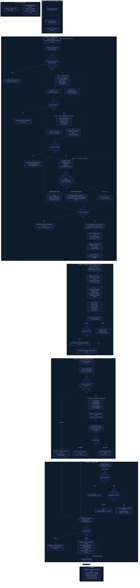

# Aquisicao Upload Flow

```mermaid
---
config:
  theme: dark
  themeVariables:
    primaryColor: '#1e3456'
    background: '#0d1b2a'
    mainBkg: '#16213e'
    nodeBorder: '#4a90d9'
    clusterBkg: '#0d1b2a'
    titleColor: '#e0e0e0'
    edgeLabelBackground: '#16213e'
    lineColor: '#4a90d9'
---
flowchart TB
 subgraph VIEW["📤 Phase 1 — Upload View (synchronous HTTP)"]
        A(["Operator uploads CSV"])
        GCS["Save CSV to GCS tmp_upload/ bucket"]
        ENQUEUE["Return 202 + task_id to frontend"]
  end

 subgraph CELERY["⚙️ Phase 2 — Upload Pipeline\n(Celery worker or Cloud Run Job — same code, different machine)"]
        TASK_START[["TASK_STARTED · ACQUISITION_UPLOAD_STARTED [w=9]"]]
        DOWNLOAD["Download CSV from GCS to local temp file"]
        VAL{"Valid headers, encoding, required columns?"}
        EVAL["ACQUISITION_UPLOAD_FAILED [w=9] — error response"]

        subgraph DEDUP_INTRA["Layer 1 — Intra-File Dedup"]
            INTRA_SPLIT["split_intra_file_duplicates on composite key\n(campo_chave + sacado_cnpj_cpf + data_aquisicao)"]
            INTRA_UNIQUE["unique_df — first occurrence of each key"]
            INTRA_DUPS["duplicates_df — subsequent occurrences\nskip_reason: parcela"]
        end

        EMPTY_AFTER_L1{"unique_df is empty?"}
        EMPTY_FAIL_L1["ACQUISITION_UPLOAD_FAILED — no valid rows"]

        subgraph DEDUP_DB["Layer 2 — Row-Level Dedup vs Production"]
            DB_QUERY["Query AquisicaoManual (production table)\non (campo_chave, sacado_cnpj_cpf, data_aquisicao)"]
            ANTI_JOIN["Anti-join: to_insert_df = rows NOT in production"]
            INNER_JOIN["Inner-join: db_duplicates_df\nskip_reason: contrato · origin: already_on_database"]
        end

        EMPTY_AFTER_L2{"to_insert_df is empty?"}
        EMPTY_FAIL_L2["ACQUISITION_UPLOAD_FAILED — all records exist in DB\nReturn duplicates CSV"]

        subgraph DEDUP_REMESSA["Layer 2.5 — Remessa-Level Dedup"]
            REM_AGG["Aggregate candidate remessa groups by identity_keys\n(cnpj_fundo, data_aquisicao, id_cessao)"]
            REM_CHECK{"Existing RemessaAquisicaoId\nwith same identity_keys?"}
            REM_PEND["Status PENDENTE/APROVADO → block ALL rows in group\nskip_reason: remessa"]
            REM_SUPER["Status REJEITADO/ROLLBACK →\nSet old to DELETADO · delete old staging\nACQUISITION_REMESSA_SUPERSEDED [w=8]"]
            REM_NONE["No existing remessa → rows pass through"]
        end

        EMPTY_AFTER_L25{"to_insert_df is empty?"}
        BLOCKED_ALL["ACQUISITION_UPLOAD_BLOCKED [w=9]\nSave + return duplicates CSV"]

        SAVE_DUPS["_save_duplicates_csv(all_duplicates_df)\nSave duplicates CSV if any exist\n(always runs — even on partial upload)"]
        CHECKSUM["Write to_insert_df to temp CSV\nCompute SHA-256 by streaming 64KB chunks"]
        AGG["Aggregate remessa groups\n(GROUP_COLS → valor_remessa, quantidade_linhas)"]
        RESULT["Return clean_df + checksum + agg_files_df + metadata"]
  end

 subgraph STAGE["💾 Phase 3 — StageRemessaService (atomic DB write)"]
        subgraph ATOMIC_TX["🔒 transaction.atomic()"]
          DB0["🟩 UploadFile · checksum · status: Imported · stream_id"]
          DB1["🟦 RemessaAquisicaoId · remessa_hash · status: Pendente\nlast_filter_result: pending · quantidade_contratos"]
          DB2["🟨 AquisicaoManualStaging · installment_hash · remessa_hash\nlast_filter_result: pending · complementary_data JSONB"]
          DB3["🟥 ContratoCCB · contract_hash · remessa_hash\nstatus: Pendente · cnpj_emissor · tipo_instrumento"]
        end
        S3["Upload deduplicated CSV → GCS staging/raw/"]
        S3FAIL["Log error — DB is committed, manual reconciliation needed"]
        EVENTS_DUP{"blocked_count > 0?"}
        DUPEV["ACQUISITION_REMESSA_DUPLICATED [w=7]"]
        COMPLETED["ACQUISITION_UPLOAD_COMPLETED [w=9]"]
  end

 subgraph FILTERGATE["🔍 Phase 4 — Filter Gates (RunFiltersService)"]
        FSTART["FILTER_RUN_STARTED · per remessa"]
        FCONFIG["Query FundFilterConfig\ncnpj_fundo · latest row per filter_def · is_active=true"]
        ZERO{"Active + implemented filters exist?"}
        VAC["FILTER_VACUOUS_PASSED [w=6]\nlast_filter_result → vacuous_pass"]
        subgraph RUNF["🧪 Filter Executor (sequential, parallel-ready)"]
          FEXEC["For each active FundFilterConfig:\nFILTER_REGISTRY → filter_cls.run()\n→ FilterOutcome(status, detail, metadata)"]
          FWRITE["Write RemessaFilterResult rows\n(update_or_create per filter)"]
        end
        PROPAGATE["_propagate_filter_status:\nUpdate last_filter_result on\nRemessa + Staging + Contracts"]
        ALLPASS{"Any filter failed?"}
        FDONE["FILTER_RUN_APPROVED [w=7]\nlast_filter_result → pass"]
        FFAILED["FILTER_RUN_REJECTED [w=8]\nlast_filter_result → fail"]
  end

 subgraph APPROVAL["✅ Phase 5 — Approval Gate"]
        READYAPPROVE(["🟢 Remessa: Pendente · last_filter_result: pass/vacuous_pass"])
        OPACTION{"Operator decides"}
        OPREJECT_A["REMESSA_USER_REJECTED [w=10] · delete staging + contracts"]
        OPAPPROVE["REMESSA_USER_APPROVED [w=10]\nAquisicaoManualStaging → AquisicaoManual\nContratoCCB: Pendente → Aprovado\nDelete staging rows (post-commit)"]
        FAILEDSTATE(["🔴 Remessa: Pendente · last_filter_result: fail"])
        ROLECHECK{"Role = Administrator?"}
        ROLEERR["403 INSUFFICIENT_ROLE"]
        JUSTCHECK{"Justification >= 20 chars?"}
        JUSTERR["400 JUSTIFICATION_TOO_SHORT"]
        OVERRIDE["FILTER_OVERRIDE_JUSTIFIED [w=9]\noverride_justification · override_by · override_at"]
        APROVADO_STATE(["🔵 Remessa: Aprovado"])
  end

 subgraph ROLLBACK["↩️ Rollback"]
        ROLLBACK_UC["REMESSA_USER_ROLLEDBACK [w=10]\nAquisicaoManual → Staging (Pendente, register_id=None)\nContratoCCB: Aprovado → Pendente (aquisicao only)\nDelete production rows"]
  end

 subgraph TTL["⏱️ TTL Job (Celery Beat)"]
        TTLCHECK["Remessas > 7 days · non-terminal status"]
        TTLACT["AquisicaoManualStaging: DELETE\nRemessa + Contratos: status → Deletado\nBATCH_TTL_EXPIRED [w=8]"]
  end

    %% Phase 1 — View
    A --> GCS --> ENQUEUE

    %% Phase 2 — Upload pipeline
    ENQUEUE --> TASK_START --> DOWNLOAD --> VAL
    VAL -- No --> EVAL
    VAL -- Yes --> INTRA_SPLIT
    INTRA_SPLIT --> INTRA_UNIQUE
    INTRA_SPLIT --> INTRA_DUPS
    INTRA_UNIQUE --> EMPTY_AFTER_L1
    EMPTY_AFTER_L1 -- Yes --> EMPTY_FAIL_L1
    EMPTY_AFTER_L1 -- No --> DB_QUERY
    DB_QUERY --> ANTI_JOIN
    DB_QUERY --> INNER_JOIN
    ANTI_JOIN --> EMPTY_AFTER_L2
    EMPTY_AFTER_L2 -- Yes --> EMPTY_FAIL_L2
    EMPTY_AFTER_L2 -- No --> REM_AGG
    REM_AGG --> REM_CHECK
    REM_CHECK -- "PENDENTE/APROVADO" --> REM_PEND
    REM_CHECK -- "REJEITADO/ROLLBACK" --> REM_SUPER
    REM_CHECK -- "None found" --> REM_NONE
    REM_PEND --> EMPTY_AFTER_L25
    REM_SUPER --> EMPTY_AFTER_L25
    REM_NONE --> EMPTY_AFTER_L25
    EMPTY_AFTER_L25 -- Yes --> BLOCKED_ALL
    EMPTY_AFTER_L25 -- No --> SAVE_DUPS
    SAVE_DUPS --> CHECKSUM
    CHECKSUM --> AGG --> RESULT

    %% Phase 3 — Atomic staging
    RESULT --> ATOMIC_TX
    DB0 --- DB1
    DB1 --- DB2
    DB2 --- DB3
    DB3 --> S3
    S3 -- success --> EVENTS_DUP
    S3 -. failure .-> S3FAIL
    EVENTS_DUP -- Yes --> DUPEV --> COMPLETED
    EVENTS_DUP -- No --> COMPLETED

    %% Phase 4 — Filters
    COMPLETED --> FSTART
    FSTART --> FCONFIG --> ZERO
    ZERO -- "None active" --> VAC
    ZERO -- "Yes" --> FEXEC
    FEXEC --> FWRITE --> PROPAGATE
    PROPAGATE --> ALLPASS
    ALLPASS -- "No failures" --> FDONE
    ALLPASS -- "Any failure" --> FFAILED
    FDONE --> READYAPPROVE
    VAC --> READYAPPROVE
    FFAILED --> FAILEDSTATE

    %% Phase 5 — Approval
    FAILEDSTATE -- "Admin override" --> ROLECHECK
    ROLECHECK -- No --> ROLEERR
    ROLECHECK -- Yes --> JUSTCHECK
    JUSTCHECK -- "Too short" --> JUSTERR
    JUSTCHECK -- OK --> OVERRIDE
    OVERRIDE --> READYAPPROVE
    READYAPPROVE --> OPACTION
    OPACTION -- Reject --> OPREJECT_A
    OPACTION -- Approve --> OPAPPROVE
    OPAPPROVE --> APROVADO_STATE
    APROVADO_STATE -- "Operator Rollback" --> ROLLBACK_UC
    ROLLBACK_UC -->|"re-enters approval gate"| OPACTION

    %% TTL
    TTLCHECK --> TTLACT
```
